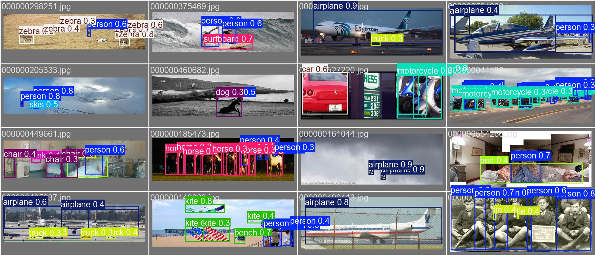
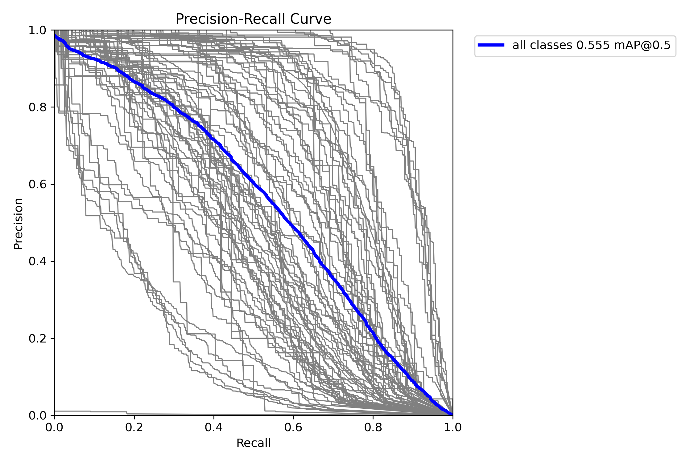
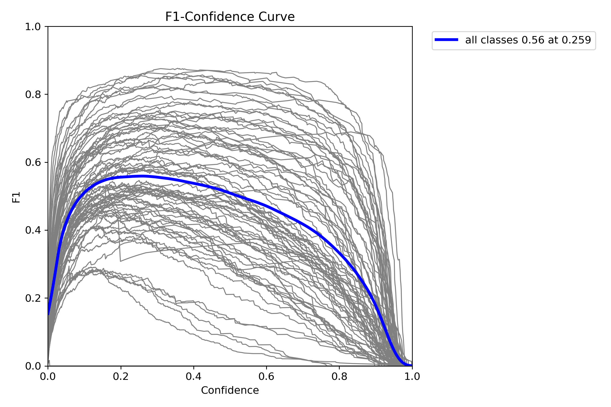
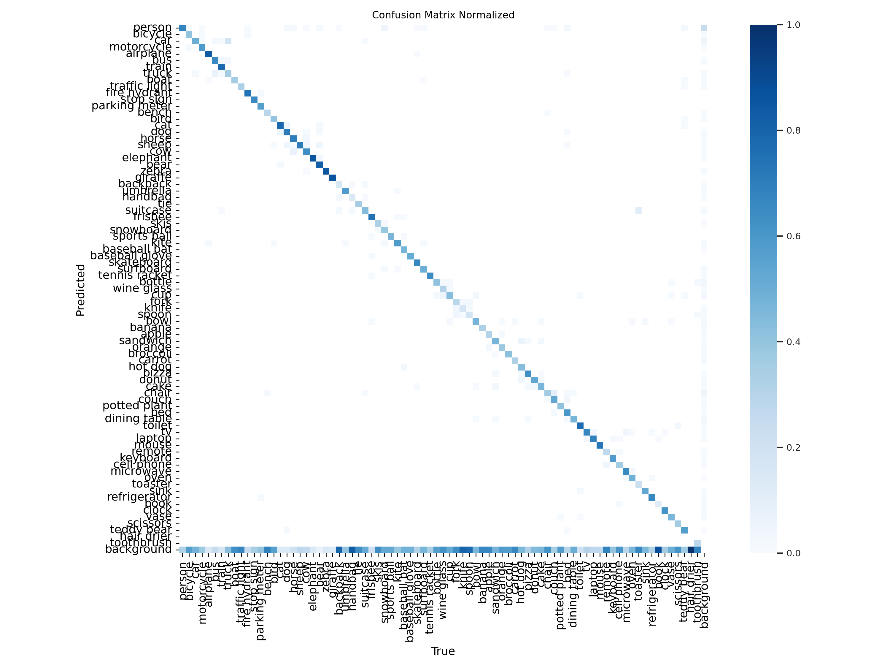
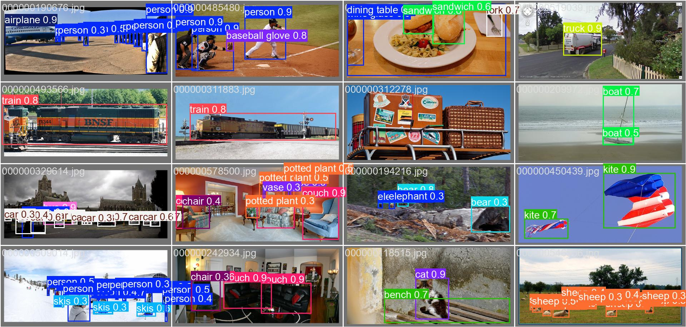

# YOLOv12n vs YOLO11n vs YOLOv8n on COCO 2017 (val)

Project report PDF: [project/report.pdf](project/report.pdf)

## Abstract

We evaluate the attention-centric YOLOv12n detector against YOLO11n and YOLOv8n on the COCO 2017 validation set. The approach uses official pretrained weights and a unified evaluation pipeline to compare accuracy and speed. YOLOv12n achieves the best overall detection accuracy, with consistent gains across small, medium, and large objects.

## Teaser Figure

## Introduction

Real-time object detection is critical for applications like robotics, traffic monitoring, and embedded perception. YOLOv12 introduces an attention-centric design intended to improve representational capacity while retaining real-time inference. This project benchmarks YOLOv12n against strong baselines (YOLO11n and YOLOv8n) on COCO to understand accuracy-speed tradeoffs in a reproducible evaluation setup.

## Approach

We used the upstream YOLOv12 repository with Ultralytics (v8.3.63) for evaluation. The system performs single-pass object detection using pretrained weights and outputs bounding boxes with class labels and confidence scores.

### Implementations Used

- YOLOv12 (upstream repository)
- Ultralytics evaluation APIs
- COCO 2017 validation split with YOLO-format labels

### Obstacles and Fixes

- Dataset paths on Kaggle required explicit symlinks into a single dataset root.
- COCO labels were missing initially; we downloaded Ultralytics YOLO-format labels and unzipped them into the dataset root.
- The dataset YAML (coco_ultra.yaml) was created to align image paths and label files.
- Pretrained weights required exact filenames (yolov12n.pt, yolo11n.pt, yolov8n.pt).

### Design Choices

- Fixed input size to 640 and batch size to 16 to keep evaluation consistent across models.
- Evaluated only the smallest model variants (n) to stay within resource limits and highlight efficiency tradeoffs.

## Experiments and Results

### Experimental Setup

- Dataset: COCO 2017 val (5,000 images, 80 classes)
- Framework: Ultralytics 8.3.63
- Hardware: Tesla T4 GPU
- Input size: 640
- Batch size: 16
- Metrics: COCO AP and AR

### Baselines

We compare YOLOv12n with YOLO11n and YOLOv8n. A naive baseline (random detections) would score near-zero mAP on COCO, so standard YOLO baselines serve as the meaningful comparison.

### Accuracy (COCO AP)

| Model    | AP50-95 | AP50  | AP75  | AP_S  | AP_M  | AP_L  |
| -------- | ------- | ----- | ----- | ----- | ----- | ----- |
| YOLOv12n | 0.404   | 0.559 | 0.435 | 0.198 | 0.447 | 0.592 |
| YOLO11n  | 0.394   | 0.553 | 0.428 | 0.198 | 0.432 | 0.570 |
| YOLOv8n  | 0.374   | 0.526 | 0.405 | 0.186 | 0.410 | 0.535 |

### Recall (COCO AR)

| Model    | AR_1  | AR_10 | AR_100 | AR_S  | AR_M  | AR_L  |
| -------- | ----- | ----- | ------ | ----- | ----- | ----- |
| YOLOv12n | 0.329 | 0.549 | 0.605  | 0.368 | 0.672 | 0.795 |
| YOLO11n  | 0.324 | 0.540 | 0.598  | 0.370 | 0.663 | 0.781 |
| YOLOv8n  | 0.320 | 0.533 | 0.589  | 0.369 | 0.654 | 0.769 |

### Speed

| Model    | Preprocess (ms) | Inference (ms) | Postprocess (ms) |
| -------- | --------------- | -------------- | ---------------- |
| YOLOv12n | 0.2             | 5.1            | 1.0              |
| YOLO11n  | 0.2             | 2.9            | 0.9              |
| YOLOv8n  | 0.2             | 3.0            | 1.0              |

### Trends and Observations

- YOLOv12n has the best overall AP50-95, improving over YOLO11n and YOLOv8n.
- Improvements are largest for large objects, while small-object AP remains challenging across all models.
- YOLOv12n is slower in this run but delivers a clear accuracy gain.

### Evaluation Plots

## Qualitative Results

## Conclusion and Future Work

YOLOv12n provides the strongest overall detection accuracy in this evaluation while maintaining practical speed. Future work includes evaluating larger YOLOv12 variants, fine-tuning on domain-specific data, and measuring end-to-end latency in a deployment setting.

## References

- YOLOv12: Attention-Centric Real-Time Object Detectors.
- Ultralytics YOLO documentation.
- COCO 2017 dataset.

## Repository Structure

- deployment/: REST API + Docker deployment
- figures/: report figures
- report.md and report.pdf: full report content and PDF
- results/: evaluation outputs (metrics, tables)
- data/: placeholder for small project data
- notebooks/: Kaggle or local notebooks

## Attribution

See [project/attribution.md](project/attribution.md) for the original paper, codebase, and license references.
